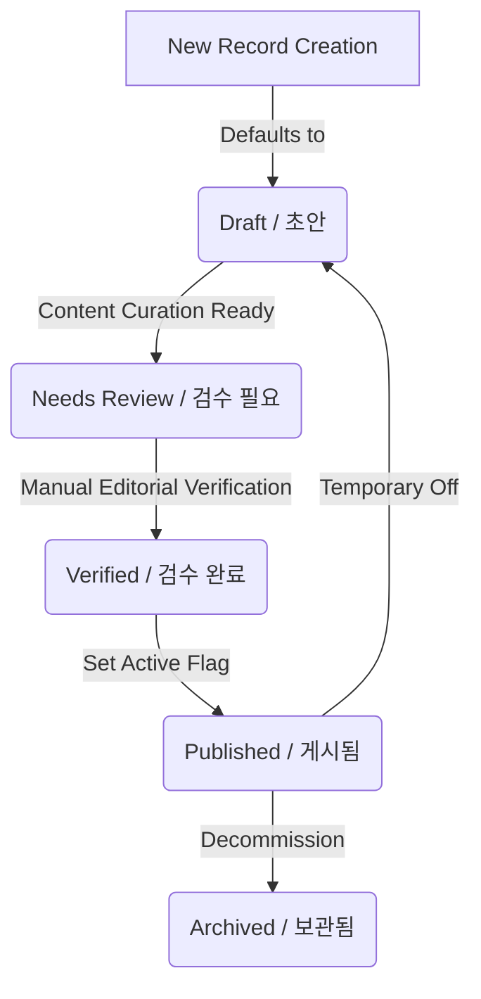

# PlannerDesk Minimal Admin Access Plan

This document details the minimal admin access planning for PlannerDesk. It establishes a secure framework and authorization design *before* implementing any authentication mechanism, RBAC code, admin routes, or database-backed Admin CRUD.

---

## A. Purpose

PlannerDesk requires a structured admin access plan prior to writing code or creating database schemas to prevent security regression, data exposure, or integration leakage. 

Currently, the PlannerDesk MVP operates entirely on static and public pages. When database-backed features are introduced, admin-only controls will be required to manage:
- **Insurer directory resources** (links, contact details, planner portals)
- **Claim document library resources** (forms, instruction guides, claim procedures)
- **Disclosure/policy link references**
- **Customer message templates** (standard text, placeholders, compliance guidance)
- **Verification status** (`draft` / `needs_review` / `verified`)
- **Published vs. Draft states** for all content entries

By defining these boundaries, security roles, and access paradigms upfront, we ensure that the team implements access control cleanly, preventing unauthorized administrative writes or unintended access to system resources.

---

## B. Current Status

The codebase is currently structured under the following constraints:
- **Public MVP Surface**: Active and composed primarily of static or client-side placeholder directories.
- **Prisma Foundation**: Configured (from PR-14) in `prisma/schema.prisma` with no active business or user models.
- **Neon PostgreSQL**: Planned and prepared, but **not utilized** by public runtime pages yet.
- **Authentication**: Not implemented.
- **Role-Based Access Control (RBAC)**: Not implemented.
- **Admin UI / Admin Shell**: Not implemented.
- **Admin CRUD Operations**: Not implemented.
- **Customer Data**: No customer data is stored, processed, or handled.
- **Customer Medical Documents**: No medical files, OCR workflows, or sensitive customer claims exist.
- **System Separation**: PlannerDesk is completely separate from BOA CRM. No connection to Aiven or the BOA CRM database exists.

---

## C. Future Admin Roles

To govern access control, we conceptually plan the following administrative and consumer roles:

### 1. `super_admin`
- **Scope**: Full system-level configuration and access.
- **Privileges**:
  - Can manage other administrators (e.g., content admins).
  - Can review and change high-risk settings or configurations.
  - Can publish, archive, delete, and verify any content.
- **Boundary**: strictly limited to the platform owner/operator.

### 2. `content_admin`
- **Scope**: Public-facing content curation and validation.
- **Privileges**:
  - Can create, edit, draft, and publish public directory resources (insurers, claims, disclosure links, templates).
  - Can mark content as verified (`verified`) or review-pending (`needs_review`).
- **Boundary**: 
  - Cannot manage system billing.
  - Cannot manage user accounts or modify roles.
  - Cannot access any customer-facing application data or settings.

### 3. `moderator`
- **Scope**: Reserved strictly for future community moderation.
- **Privileges**: Can moderate posts, comments, and community discussions.
- **Boundary**: 
  - Not needed for the initial Admin CRUD features.
  - Will not be introduced until planner community features are ready.
  - Has zero access to insurer directory or claim library admin screens.

### 4. `verified_planner`
- **Scope**: Premium public user account (verified insurance planners).
- **Privileges**: Accesses verified-only planner community modules or specialized tools.
- **Boundary**: 
  - **Not an admin role.**
  - Absolutely no access to administrative content management panels or system settings.

---

## D. First Admin Access Recommendation

We evaluate two conceptual directions for early admin authentication:

### Option 1: Manual Allowlist Admin Access
- **Mechanism**: Store a hardcoded server-side environment variable or build-time config containing allowed administrator emails.
- **Pros**: Low complexity, rapid startup, zero database dependencies for credentials.
- **Cons**: Not scalable long-term; requires environment variable redeployments to update administrators.

### Option 2: Database-backed Admin Users
- **Mechanism**: Store users, sessions, and roles in database tables (`User`, `Session`, `Role`) queried via an ORM.
- **Pros**: Highly scalable, supports role changes on the fly, allows visual admin management.
- **Cons**: High initial implementation risk, requires schema migration, and complex integration.

### Recommendation
To balance rapid initial velocity with long-term safety, we recommend the following evolutionary sequence:
1. **Define the Plan** (Current PR-15): Solidify design and access policies.
2. **Implement Safe Auth Foundation**: Deploy a locked-down session and credentials framework (NextAuth/Auth.js with server-side allowlist / early provider settings).
3. **Introduce Roles (`super_admin` & `content_admin`)**: Enable access shell checks.
4. **Implement Insurer Directory Admin CRUD First**: Introduce DB-backed content with the simplest, lowest-risk model.

---

## E. Future Auth Approach

For authentication implementation:
- **Framework**: Use [Auth.js (formerly NextAuth.js)](https://authjs.dev) as it integrates natively with Next.js App Router.
- **Secrets Management**: 
  - Environment variables such as `AUTH_SECRET`, `AUTH_URL`, and OAuth provider secrets (`AUTH_GOOGLE_ID`, `AUTH_GOOGLE_SECRET`, etc.) must be configured **exclusively** in Railway Environment Variables.
  - No development, staging, or production secrets, nor placeholders with similar formats, may be committed to GitHub.
- **Login Options**: The final decision to support Email (Magic Links) or Google/OAuth login requires an explicit product-owner sign-off. Auth will **not** be written or configured in this PR.

---

## F. Access Control Principles

All future administrative implementations must adhere to these non-negotiable security principles:
1. **Server-Side Enforcement**: Never rely on frontend visibility toggles (hiding buttons in UI) to protect pages or actions. All admin screens, Next.js Server Actions, and API Route handlers must validate authorization server-side.
2. **Reject Unauthenticated Users**: Unauthenticated requests requesting `/admin` sub-routes or administrative functions must be immediately blocked, returning an HTTP `401 Unauthorized` or redirecting securely to the login route.
3. **Strict Role Verification**: Every write action (create, update, publish, verify, archive) must explicitly check that the active session's role is authorized (`super_admin` or `content_admin`).
4. **Principle of Least Privilege**: A `content_admin` must not receive `super_admin` capabilities. They cannot manage user roles or database configurations.
5. **No Exposure of Admin State**: Administrative metadata or configuration status details must not be exposed in client bundles or public-facing API responses.
6. **Public Page Filters**: Once database integration is completed, public pages must only retrieve records where `isPublished = true`. Draft and reviewed content should only reside in secure preview states.

---

## G. Admin Route Planning

Future administrative features will utilize the following Next.js sub-routes:
- `/admin` (Access Dashboard Shell)
- `/admin/insurers` (Insurer Directory Curation)
- `/admin/claim-documents` (Claim Forms Curation)
- `/admin/disclosure-links` (Policy and Disclosure References)
- `/admin/message-templates` (Customer Message Templates)

> [!WARNING]
> Do not create these folders, routes, or placeholder screens in this PR.

### Future Route Implementation Sequence
1. **`/admin` Shell**: Deploy a locked, minimal layout verifying session and role validation.
2. **`/admin/insurers`**: The baseline CRUD module to test the Prisma client and DB pipelines.
3. **`/admin/claim-documents`**: Intermediate CRUD handling document links.
4. **`/admin/disclosure-links`**: Standard reference link directory management.
5. **`/admin/message-templates`**: Curation of communication structures.

---

## H. Admin CRUD Permissions Matrix

The access permissions for administrative resources are structured as follows:

| Resource | `super_admin` | `content_admin` | `moderator` | `verified_planner` |
| :--- | :--- | :--- | :--- | :--- |
| **Insurer Directory** | Create, Read, Update, Publish, Archive | Create, Read, Update, Request Publish / Publish (if approved) | No Access | No Access |
| **Claim Documents** | Create, Read, Update, Publish, Archive | Create, Read, Update, Request Publish / Publish (if approved) | No Access | No Access |
| **Disclosure Links** | Create, Read, Update, Publish, Archive | Create, Read, Update, Request Publish / Publish (if approved) | No Access | No Access |
| **Message Templates** | Create, Read, Update, Publish, Archive | Create, Read, Update, Request Publish / Publish (if approved) | No Access | No Access |

*Note: Deletions are mapped as "Archive" to preserve referential integrity and audit records.*

---

## I. Verification and Publishing Workflow

The editorial lifecycle of directory data will operate with explicit state tags:

### Workflow Rules
- **Draft Defaults**: All newly created records must default to `draft` (`초안`).
- **Public Isolation**: Draft records must **never** be served to public-facing pages unless marked as explicit sample entries in the static MVP codebase.
- **`needs_review` (`검수 필요`)**: Denotes that an entry has been edited by a content administrator but requires review/validation.
- **`verified` (`검수 완료`)**: Confirms official source checking has been completed by an operator.
- **No Spoofed Dates**: No fake or automatic `lastVerifiedAt` timestamps may be inserted. A timestamp is updated only upon a human operator's manual verification click.
- **Missing Resource Fields**: If official website references or telephone links are missing, show the localization fallback:
  > `"공식 확인 후 업데이트 예정"` (To be updated after official confirmation)

---

## J. Audit Log Planning

To guarantee complete compliance and platform safety, all administrative actions must be logged. 

### Audit Log Schema Fields
- `id` (Unique ID)
- `actorUserId` (The ID of the administrator making the change)
- `action` (e.g., `CREATE`, `UPDATE`, `PUBLISH`, `UNPUBLISH`, `ARCHIVE`, `VERIFY`, `ROLE_CHANGE`)
- `targetType` (The affected resource model, e.g., `Insurer`, `ClaimDocument`)
- `targetId` (The database ID of the modified resource)
- `beforeValue` (JSON snapshot of the record before the change)
- `afterValue` (JSON snapshot of the record after the change)
- `createdAt` (Timestamp of the event)
- `metadata` (Additional diagnostic data, such as IP or client version)

### Monitored Actions
- Resource Creation (`CREATE`)
- Content updates (`UPDATE`)
- Publishing updates (`PUBLISH`, `UNPUBLISH`)
- Archival operations (`ARCHIVE`)
- Verification changes (`VERIFY`)
- Admin privilege changes (`ROLE_CHANGE`)
- Admin authentication events (`LOGIN_ATTEMPT`, `LOGIN_SUCCESS`)

---

## K. Security Rules

To enforce secure repository operations:
1. **No Hardcoded Secrets**: Do not store database connection strings, passwords, direct URLs, Auth secrets, or developer variables in the codebase or in documentation files.
2. **No Git Env Commits**: Ensure `.env` is never committed. Keep `.env.example` strictly populated with placeholder values.
3. **Railway Variables Only**: Configuration tokens must remain within protected Railway environments.
4. **No BOA CRM or Aiven Connections**: Under no circumstances should database credentials or data definitions from BOA CRM or Aiven be used.
5. **No Customer Data in Seeds**: Seed or testing scripts must not include real user identifiers or contact info.
6. **No Real File Uploads**: Real file uploads are barred until an isolated upload scan and permission plan is approved.

---

## L. Manual Approval Required Before Implementation

To prevent unauthorized merge changes, **any PR containing code in the following areas must undergo manual peer review and is excluded from auto-merging workflows**:
- Authentication implementation (NextAuth / Auth.js setups)
- Role-based Access Control (RBAC) code
- Access control privilege modifications
- Prisma database migrations
- Security schemas (`User`, `Session`, `Account`, `VerificationToken` tables)
- Protected writes or server actions
- Payment or billing structures
- File upload handlers
- Customer data modifications (including medical and personal data)
- Connections to BOA CRM databases or Aiven
- Destructive schema modifications (dropping columns/tables)
- Custom server-side routing middlewares

---

## M. Recommended Next PRs

To incrementally implement PlannerDesk content management features:

1. **PR-16**: Auth Foundation Planning (Document the auth strategy and environment variables, see `AUTH_FOUNDATION_PLAN.md`).
2. **PR-17**: Auth.js Foundation Implementation (Introduce Auth.js dependencies, environment configurations, and server blockages).
3. **PR-18**: Minimal Protected Admin Shell (Create route protection checks and layout shell under `/admin`).
4. **PR-19**: Insurer Model & Prisma Migration (Draft the Insurer schema and deploy the migrations under manual approval).
5. **PR-20**: Insurer Directory Admin CRUD (Build the forms, actions, and audit log hooks for insurer models).
6. **PR-21**: Audit Log Infrastructure (Create the global logging schema and database triggers).
