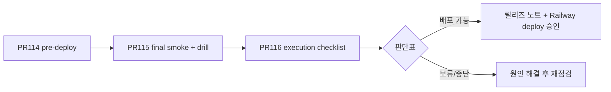

# PR-116 — 제한 배포 실행 준비

**목적:** 실제 Railway 배포·rollback·migration을 **실행하지 않고**, 운영자가 “지금 배포해도 되는가”를 판단할 준비 자료를 정리한다.

**선행 (필수):**

| 단계 | 문서 |
| --- | --- |
| PR114 | [PR-114-LIMITED-RELEASE-OPS.md](./PR-114-LIMITED-RELEASE-OPS.md) |
| PR115 | [PR-115-LIMITED-RELEASE-FINAL-OPS.md](./PR-115-LIMITED-RELEASE-FINAL-OPS.md) |

**PR116 문서:**

| 문서 | 용도 |
| --- | --- |
| [PR-116-PRE-DEPLOY-EXECUTION-CHECKLIST.md](./PR-116-PRE-DEPLOY-EXECUTION-CHECKLIST.md) | 실행 전 A~G |
| [PR-116-DEPLOY-EXECUTION-READINESS-DECISION.md](./PR-116-DEPLOY-EXECUTION-READINESS-DECISION.md) | 배포 가능/보류 판단 + 서명 |

**실제 배포 후 (PR117):** [PR-117-POST-LIMITED-RELEASE-SMOKE-OPS.md](./PR-117-POST-LIMITED-RELEASE-SMOKE-OPS.md)

---

## PR116에서 하지 않는 것

- `railway up`, `git push`로 production 트리거, `npm run release:migrate`
- rollback redeploy 실행
- `.env` / Railway Variables **값** 열람·출력·수정
- 운영 DB 쿼리, allowlist/bulk/public 데이터 변경

---

## 실행 준비 흐름 (운영자)

1. Git·검증 명령·환경변수 **이름**·migration 필요 여부·rollback SHA 기입  
2. 스테이징에서 PR115 C/D smoke (미완 시 보류)  
3. [판단표](./PR-116-DEPLOY-EXECUTION-READINESS-DECISION.md) 서명  
4. **별도 승인 후**만 실제 deploy/migrate (본 PR 범위 밖)

---

## Antigravity 검수

- [ ] 실행 준비만이고 실제 deploy 없음
- [ ] secret 값 문서·로그 미포함
- [ ] migration 판단·rollback SHA 절차 명확
- [ ] product code diff 없음

**Codex:** 기본 생략 (docs-only). DB/Auth/secret 기준 불명확 시 [판단표 Codex 절](./PR-116-DEPLOY-EXECUTION-READINESS-DECISION.md).
