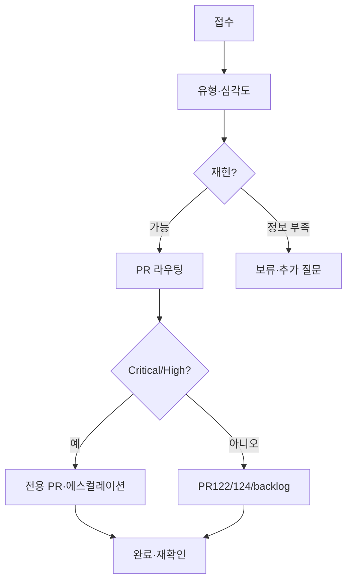

# PR-121 — 피드백 처리 흐름 · 상태값

---

## 처리 흐름

```text
피드백 접수
  → 유형 분류 (PR-121-FEEDBACK-TYPES)
  → 심각도 지정 (PR-121-FEEDBACK-SEVERITY-AND-PRIORITY)
  → 재현 여부 확인
  → 분기: 즉시 반영 | 별도 PR | 보류 | 정보 부족
  → 처리 PR 연결 (PR-121-FEEDBACK-TO-PR-ROUTING)
  → 완료 후 재확인 (smoke/회귀)
```



---

## 처리 상태값

| 상태 | 의미 | 다음 액션 |
| --- | --- | --- |
| **접수** | Registry에 행 추가됨 | 분류·심각도 |
| **검토 중** | 담당 확인·재현 시도 | PR 결정 |
| **반영 예정** | 처리 PR 확정 | 개발·문서 PR |
| **보류** | 출처·정책·재현 대기 | 비고 갱신 |
| **완료** | 반영·재확인 완료 | 주간 요약 |
| **정보 부족** | 원문·환경 불명 | 제보자 추가 정보 |

---

## 분기 기준

| 분기 | 조건 |
| --- | --- |
| **즉시 반영** | Low/Medium + 문구·빈 상태·단순 UX, 재현 확인 |
| **별도 PR** | High+, Auth/DB/schema, 데이터 대량, AA 정책 |
| **보류** | 공식 출처 미확인 데이터, 정책 결정 대기 |
| **정보 부족** | 재현·기대 동작·화면 불명 |

---

## 처리 규칙

- **Critical/High** → 일반 backlog만으로 종료 금지
- **데이터 오류** → 공식 출처 확인 전 코드·DB 수정 금지
- **Auth/DB/Migration** → 별도 PR, PR121에서 구현 금지
- **단순 문구/UX** → PR122 등 운영 개선 PR

---

## Codex 제한검수

| 조건 | 제안 |
| --- | --- |
| Critical/High + 권한·visibility·PII | 제한검수 후보 |
| 문서·표만 | **생략** |
