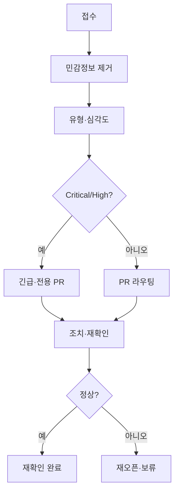

# PR-129 — 운영 이슈 처리 흐름 · 상태값

---

## 처리 흐름

1. 이슈 접수 (`OPS-*` 행 추가)
2. **민감정보 제거** ([PII 규칙](./PR-129-PII-AND-SENSITIVE-DATA-RULES.md))
3. 화면/기능 분류
4. 이슈 유형 분류 ([유형](./PR-129-ISSUE-TYPES.md))
5. 재현 여부 확인
6. 심각도 지정 ([심각도](./PR-129-ISSUE-SEVERITY.md))
7. 분기: **즉시 조치** / 후속 PR / 보류 / 정보 부족
8. 담당자 지정
9. 연결 PR 기록 ([라우팅](./PR-129-ISSUE-TO-PR-ROUTING.md))
10. 수정·문서·운영 조치
11. 재확인 (smoke·회귀·운영자 확인)
12. **재확인 완료** 또는 재오픈

---

## 상태값

| 상태 | 의미 | 처리 기준 |
| --- | --- | --- |
| **접수** | 처음 기록됨 | 유형·심각도 분류 |
| **확인 중** | 재현·영향 범위 확인 | 담당 지정 |
| **수정 예정** | 수정 방향 확정 | 연결 PR 기입 |
| **보류** | 출처·정책·재현 대기 | 필요 자료 명시 |
| **완료** | 조치 완료 | 재확인 대기 |
| **재확인 완료** | 처리 후 정상 확인 | 이슈 종료 |
| **정보 부족** | 화면·재현·근거 부족 | 추가 정보 요청 |
| **긴급** | Critical/High 리스크 | 즉시 조치·에스컬레이션 |

---

## 필수 원칙

- 공식 출처 필요 **데이터** → 확인 전 수정·단정 금지
- **권한 · visibility · secret · 운영 DB** → High 이상, Critical 검토
- **Answer Assistant** → allowlist·output·audit·retention ([PR-126](./PR-126-ANSWER-ASSISTANT-BETA-OPS.md))
- 처리 완료 후 **재확인 여부** 필수 기록

---

## Codex 제한검수

| 조건 | 제안 |
| --- | --- |
| Critical/High + 권한·visibility·PII·운영 DB | 제한검수 후보 |
| 문서·표만 | **생략** |
